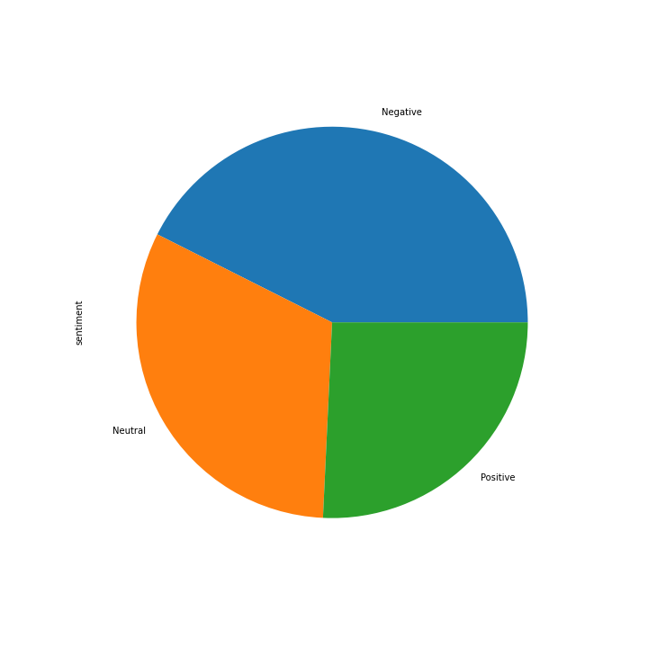

# Ejemplo_PrDev_snscrape
Ejemplo de uso de librería snscrape para presentación de la clase de de Desarrollo de Proyecto. Maestría en Ciencia de los Datos. Universidad de Guadalajara (UDG)

## Planteamiento del problema

Realizar un análisis de sentimiento de 1,000 tweets para saber el consenso general (positivo, negativo, neutral) del término de búsqueda "Donald Trump".

## Observaciones

- Debido a ciertos aspectos de la API de Twitter (límite de cantidad de consultas, dificultad para obtener Key de desarrollador y posibles cambios en la organización de Twitter) es conveniente utilizar un scraper como snscrape.

- Conviene también utilizar un modelo de análisis de sentimiento pre-entrenado (vader)  ya que este no es el enfoque del ejercicio.

## Resultados

El proceso realizado se encuentra en el siguiente [Notebook](src/snscrape_sentimiento_trump.ipynb)

Se obtienen los siguientes datos (primeras 5 líneas de la tabla):

|date                     |id                 |content                                                                                                                                                                                                                                                                                                            |username       |like_count|retweet_count|
|-------------------------|-------------------|-------------------------------------------------------------------------------------------------------------------------------------------------------------------------------------------------------------------------------------------------------------------------------------------------------------------|---------------|----------|-------------|
|2023-03-22 04:12:14+00:00|1638393121863094272|#PensándoloBien (programa completo) con Gonzalo Sánchez - 21/03/23 https://t.co/x29DQXxtws vía @Aenfoco #BuenMartes #corralito IVA al 24% El PBI Ventura #DonaldTrump Duggan Corea del Norte Corazza Otoño Ferraresi                                                                                               |Aenfoco        |0         |0            |
|2023-03-22 04:12:07+00:00|1638393090783191040|@JoJoFromJerz 8 years and counting....so when's it supposed to happen?  The "End of Donald Trump", I mean?                                                                                                                                                                                                         |whipplewart    |0         |0            |
|2023-03-22 04:12:05+00:00|1638393082273226753|@noclador Who's Donald Trump?                                                                                                                                                                                                                                                                                      |Zatananas      |0         |0            |
|2023-03-22 04:12:03+00:00|1638393075138437122|Donald trump is NOT a Republican !!!!!He is a Communist Reality TV Star / business man/ Satan                                                                                                                                                                                                                      |EricaGotcha    |0         |0            |
|2023-03-22 04:12:01+00:00|1638393064619233281|Hey Jim Jordan Your committee is a joke, especially since you are head of it . The only thing that has been weaponized is your brains . Look no further it's in your head . You Donald Trump wanna be !                                                                                                            |LKaye2         |0         |0            |

Se gráfican los resultados en la siguiente gráfica de pastel:

## Referencias

Algunos de los materiales de consulta utilizados se encuentran en este [documento](doc/Referencias.md).
